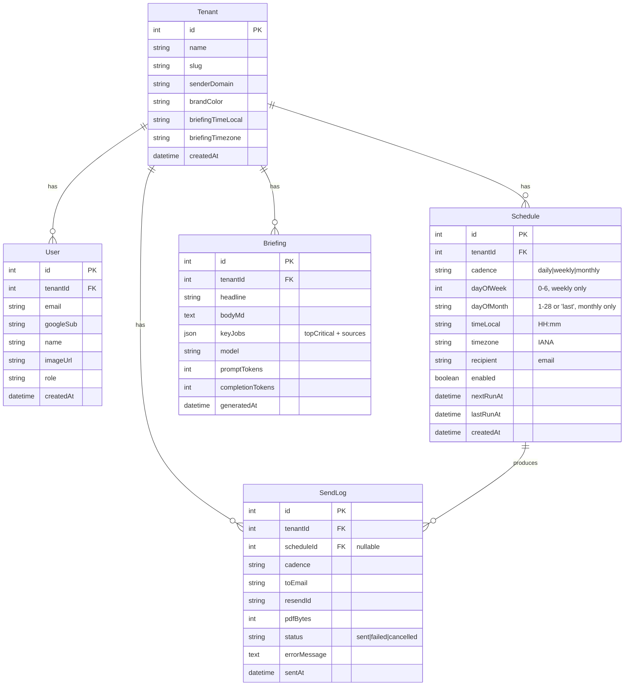

# Vera — Data model

What's in the database, what every field means, and how the derived
metrics (heat score, aging buckets, anomalies) are computed.

> Last updated: May 8, 2026.

---

## ER diagram



Schema source: `apps/web/prisma/schema.prisma`.

---

## Persistent tables

### `Tenant`

One row per onboarded company. Today there is exactly **one tenant**:
Priority Roofs Dallas (`id=1`, slug `priority-roofs-dallas`,
`briefingTimezone=America/Chicago`).

- `senderDomain` — the verified-on-Resend domain for outbound mail
  (`makanalytics.org` for now)
- `brandColor` — hex string used in the email PDF header

### `User`

Created on first Google sign-in. Bound to a tenant by the `signIn`
callback in `lib/auth.ts`. Today every new user gets `tenantId=1`.

- `googleSub` — Google's stable user ID. Used to match returning users.
- `role` — `'member'` or `'admin'`. Not yet enforced in the app; reserved.

### `Schedule`

The recurring-delivery configuration. One row per schedule the user
sets up via `/dashboard/scheduler`.

- `cadence` — one of `daily | weekly | monthly`
- `timeLocal` — `HH:mm` in 24h format, **always on the 15-minute grid**
  (`00`, `15`, `30`, `45`). Enforced by client-side snap on blur and
  server-side snap on POST in `/api/schedules/route.ts`.
- `timezone` — IANA tz name (e.g. `America/Chicago`, `Asia/Kolkata`).
  Set from the operator's browser at create time, not the tenant's.
- `nextRunAt` — UTC timestamp the dispatcher checks. Computed by
  `lib/cadence.ts → computeNextRun`. DST-safe.
- `lastRunAt` — set by the dispatcher after a successful or failed
  attempt. Used to display "last fired" in the UI (not yet wired).
- `enabled` — false = paused (UI greys out the row, dispatcher skips it
  via the `enabled: true` filter).

### `Briefing`

Vera's daily AI-generated dashboard briefing. One row per generation.
The dashboard renders the most recent row.

- `headline` — single sentence. Plain text (markdown forbidden in the
  prompt to avoid literal `**` rendering).
- `bodyMd` — short markdown briefing (≤2 paragraphs, ≤3 sentences each
  per the system prompt). Rendered with bolded keywords.
- `keyJobs` — JSON blob containing `topCritical` (array of 5 critical
  jobs) and `sources` (NWS alerts + news headlines used as context).
  Fed to the BriefingCard for source chip rendering.
- `model` — `gpt-4o`
- `promptTokens` / `completionTokens` — for cost tracking; not yet
  surfaced anywhere

### `SendLog`

Audit trail for every email Resend send attempt. Source of truth for
"did this brief actually go out?"

- `scheduleId` — nullable. Set when the dispatcher fires a scheduled
  send; null for ad-hoc "Send now" sends.
- `status` — `sent` if Resend accepted, `failed` if it didn't.
- `resendId` — Resend's message ID. Look up delivery status at
  `https://resend.com/emails/<resendId>` or via their API.
- `pdfBytes` — size of the attached PDF. Useful sanity check (typical
  brief is ~38 KB).
- `errorMessage` — populated only on `status='failed'`.

---

## Derived metrics — computed at runtime, not stored

Vera's interesting numbers (heat score, aging bucket, anomalies, "fell
through cracks") are not in the DB. They're derived from raw job data
in `data/generated.json` (which itself is the preprocessed snapshot of
RoofLink's export at `data/jobs_dedup.jsonl`).

All derivation lives in `shared/domain/*` — pure functions, no I/O,
testable.

### Heat score (0–100)

Formula in `shared/domain/src/heat-score.ts`. Per `SPEC.md` Q4:

```
heat = (40% · daysPastTermsScore)
     + (25% · balanceScore)
     + (20% · repSilenceScore)
     + (15% · anomalyCountScore)
```

Each component is normalized to 0–100, then weighted and summed.

**Bands:**

| Band | Heat | Treatment |
|---|---|---|
| Cool | 0–25 | On track. No action. |
| Warm | 26–50 | Visible to AR. No nudge yet. |
| Hot | 51–75 | Vera drafts a follow-up email for the rep. |
| Critical | 76+ | Skips rep entirely → Executive Review Queue. |

Heat-score breakdown is shown on the dashboard via `<HeatMeter>`. Hover
to see the four contributing numbers. No black box — that's a hard
constraint from `CLAUDE.md`.

### Aging buckets

Computed in `shared/domain/src/aging.ts`. Per `SPEC.md` Q3:

| Bucket | Definition |
|---|---|
| `within-terms` | `daysPastTerms <= 0` |
| `1-30-past` | `1 <= daysPastTerms <= 30` |
| `31-60-past` | `31 <= daysPastTerms <= 60` |
| `60-plus-past` | `daysPastTerms > 60` |

`daysPastTerms` is calculated **relative to the customer's payment
terms**, not the calendar:

```
daysPastTerms = daysSinceInstall - netTerms
```

Where `netTerms` is **30** for retail, **60** for insurance jobs (per
`SPEC.md` Q3). A 50-day-old insurance job is on time; a 35-day-old
retail job is 5 days past.

### Anomalies

Five anomaly rules in `shared/domain/src/anomalies.ts`:

| Rule | What it flags |
|---|---|
| No cert of completion | Job marked installed, but COC milestone never logged |
| Insurance final-check stuck | Insurance job has the first check but never the final |
| No commission request | Commission milestone is missing |
| Retail — no payments | Retail job, installed, no payment recorded |
| Impossible payments | `payments > gtPrice` (overpayment looks like a data error) |

Each anomaly contributes to the `anomalyCount` heat-score component.
Hover the `+N more` badge in the aging table for the full list.

### "Fell through cracks"

Computed in `shared/domain/src/reconciliation.ts`. A completed install
falls through cracks if **all four** of these are true:

1. No certificate of completion logged
2. No commission request
3. (Insurance) no final check endorsed
4. No edit to the job record in the last **14 days**

Surfaced on `/dashboard/reconciliation`. Updated weekly.

---

## Read-only on RoofLink data

Per `CLAUDE.md` and the SPEC: `data/jobs_dedup.jsonl` is **read-only**.
Vera never writes back to RoofLink. All "edits" are draft emails the rep
sends manually.

The `Briefing`, `Schedule`, `SendLog` and `User` tables in our Postgres
are the only places Vera persists state. Those are app-level, not
customer-data.

---

## How fresh is the data?

| Source | Refresh cadence | How |
|---|---|---|
| `data/generated.json` (the snapshot) | Manual | Run `pnpm preprocess` from the repo root, commit the regenerated file |
| `Briefing` (AI dashboard briefing) | Daily, weekdays at 7am Central via the `generate-briefings` Upstash QStash schedule | OR on-demand via the "Fetch latest news" button |
| `Schedule.nextRunAt` | After each fire, advanced via `computeNextRun` | The dispatcher claims a row by atomically advancing this field |
| RoofLink → snapshot pipeline | Currently manual | Not yet implemented. `backfill.py` (repo root) is the reference Israel shared |

The "live RoofLink sync" cron is **not built**. Israel has shared a
reference implementation at `backfill.py` (repo root). Status tracked
in `IMPROVEMENTS.md`.

---

## Where to look in the code

| Concept | File |
|---|---|
| Schema source | `apps/web/prisma/schema.prisma` |
| Initial migration | `apps/web/prisma/migrations/20260507104000_init/migration.sql` |
| Tenant seed | `apps/web/prisma/seed.ts` |
| Heat score | `shared/domain/src/heat-score.ts` |
| Aging buckets | `shared/domain/src/aging.ts` |
| Anomalies | `shared/domain/src/anomalies.ts` |
| Reconciliation | `shared/domain/src/reconciliation.ts` |
| Cadence math (DST-safe) | `apps/web/lib/cadence.ts` |
| Briefing generator (AI) | `apps/web/lib/briefing-generator.ts` |
| Dispatcher (claim + send) | `apps/web/app/api/cron/dispatch-briefs/route.ts` |
| Brief sender + PDF | `apps/web/app/api/brief/send/route.ts` + `apps/web/lib/daily-brief-pdf.ts` |
