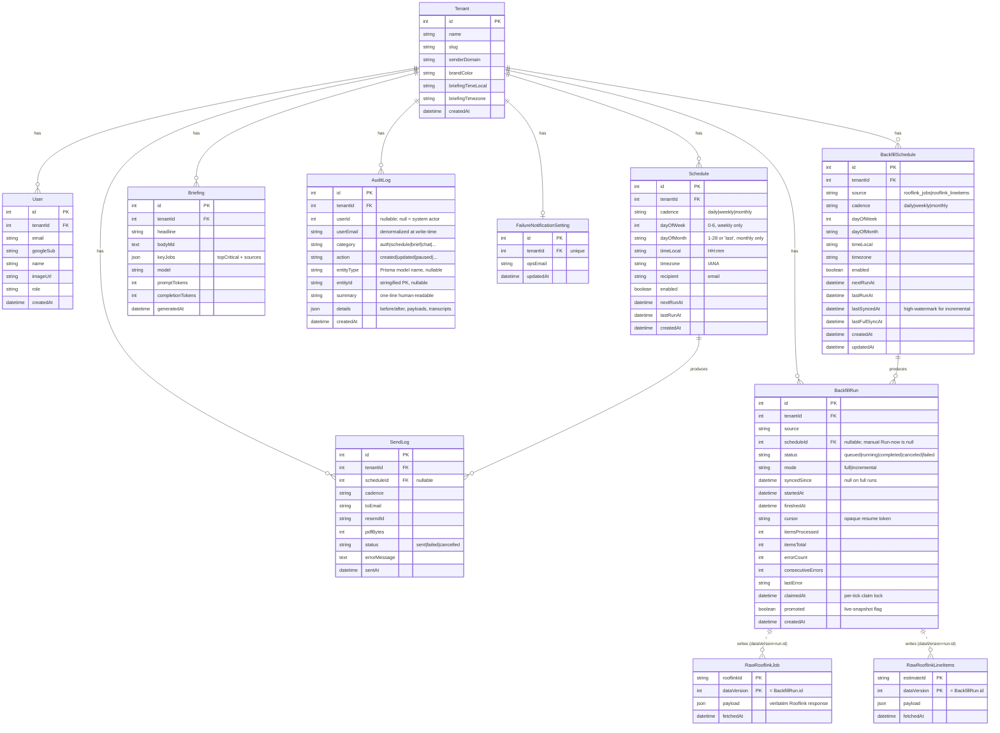
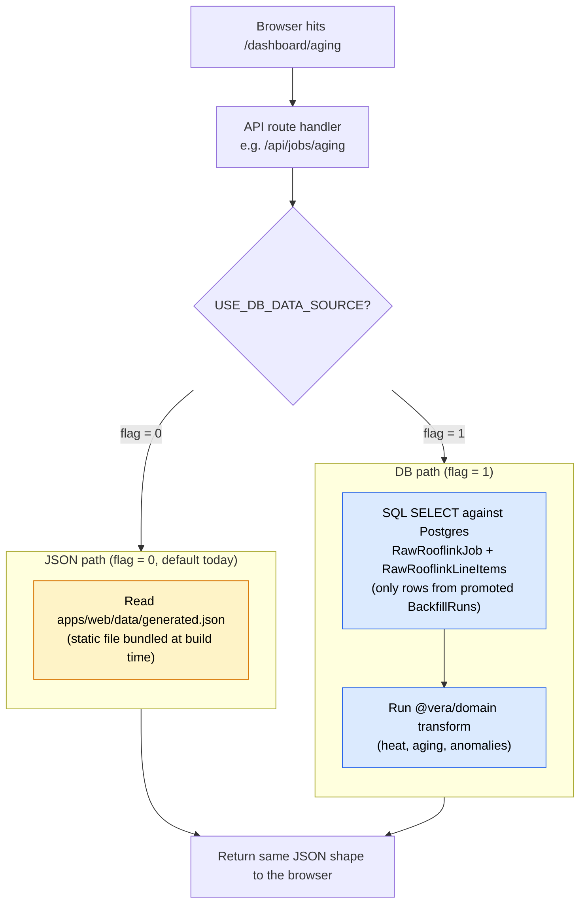

# Vera — Data model

What's in the database, what every field means, and how the derived
metrics (heat score, aging buckets, anomalies) are computed.

> Last updated: May 14, 2026.

---

## ER diagram

The DB has **11 tables** grouped into three logical clusters: app state (the
original five), the audit and ops surface (added with the audit-log work),
and the backfill machinery (added with the Rooflink ingest pipeline). Raw
Rooflink payloads are versioned by `BackfillRun.id` rather than a hard FK —
the relationship is shown dashed to reflect that.



Schema source: `apps/web/prisma/schema.prisma`.

---

## Persistent tables

### `Tenant`

One row per onboarded company. Today there is exactly **one tenant**:
Priority Roofs Dallas (`id=1`, slug `priority-roofs-dallas`,
`briefingTimezone=America/Chicago`).

- `senderDomain` — the verified-on-Resend domain for outbound mail
  (`makanalytics.org` for now)
- `brandColor` — hex string used in the email PDF header

### `User`

Created on first Google sign-in. Bound to a tenant by the `signIn`
callback in `lib/auth.ts`. Today every new user gets `tenantId=1`.

- `googleSub` — Google's stable user ID. Used to match returning users.
- `role` — `'member'` or `'admin'`. Not yet enforced in the app; reserved.

### `Schedule`

The recurring-delivery configuration. One row per schedule the user
sets up via `/dashboard/scheduler`.

- `cadence` — one of `daily | weekly | monthly`
- `timeLocal` — `HH:mm` in 24h format, **always on the 15-minute grid**
  (`00`, `15`, `30`, `45`). Enforced by client-side snap on blur and
  server-side snap on POST in `/api/schedules/route.ts`.
- `timezone` — IANA tz name (e.g. `America/Chicago`, `Asia/Kolkata`).
  Set from the operator's browser at create time, not the tenant's.
- `nextRunAt` — UTC timestamp the dispatcher checks. Computed by
  `lib/cadence.ts → computeNextRun`. DST-safe.
- `lastRunAt` — set by the dispatcher after a successful or failed
  attempt. Used to display "last fired" in the UI (not yet wired).
- `enabled` — false = paused (UI greys out the row, dispatcher skips it
  via the `enabled: true` filter).

### `Briefing`

Vera's daily AI-generated dashboard briefing. One row per generation.
The dashboard renders the most recent row.

- `headline` — single sentence. Plain text (markdown forbidden in the
  prompt to avoid literal `**` rendering).
- `bodyMd` — short markdown briefing (≤2 paragraphs, ≤3 sentences each
  per the system prompt). Rendered with bolded keywords.
- `keyJobs` — JSON blob containing `topCritical` (array of 5 critical
  jobs) and `sources` (NWS alerts + news headlines used as context).
  Fed to the BriefingCard for source chip rendering.
- `model` — `gpt-4o`
- `promptTokens` / `completionTokens` — for cost tracking; not yet
  surfaced anywhere

### `SendLog`

Audit trail for every email Resend send attempt. Source of truth for
"did this brief actually go out?"

- `scheduleId` — nullable. Set when the dispatcher fires a scheduled
  send; null for ad-hoc "Send now" sends.
- `status` — `sent` if Resend accepted, `failed` if it didn't.
- `resendId` — Resend's message ID. Look up delivery status at
  `https://resend.com/emails/<resendId>` or via their API.
- `pdfBytes` — size of the attached PDF. Useful sanity check (typical
  brief is ~38 KB).
- `errorMessage` — populated only on `status='failed'`.

### `AuditLog`

Append-only activity stream. Every meaningful user or system action lands
here — schedule edits, brief sends, chat queries, OAuth callbacks, backfill
state transitions. Two write paths feed the same table; see `CLAUDE.md`
"Audit logging" for the integration rules and `shared/types/audit.ts` for
the typed category/action catalog.

- `userId` — `null` when the actor is a cron job, script, or system task.
- `userEmail` — denormalized at write-time so the row stays readable even
  if the `User` row is later deleted.
- `category` / `action` — both plain strings on the DB column (adding a new
  category never requires a migration); validated against the catalog in
  the API layer and the UI filters.
- `entityType` / `entityId` — Prisma model name plus stringified PK when
  the row references a concrete entity. Null for auth + chat events.
- `details` — flexible JSON. Typically `{ before, after, changedFields }`
  for mutations; full conversation transcript for chat; OAuth metadata for
  auth. The detail-sheet renderer per category lives in
  [apps/web/app/dashboard/audit-logs/AuditLogsView.tsx](../apps/web/app/dashboard/audit-logs/AuditLogsView.tsx).

### `FailureNotificationSetting`

One row per tenant. Holds the ops email that receives notifications when a
brief send or a backfill run fails. Deliberately distinct from the
per-cadence `Schedule.recipient` — operators want failures routed to a
different inbox than the briefs themselves.

### `BackfillSchedule`

Recurring backfill config — mirrors `Schedule` for the Rooflink ingest
pipeline. One row per `(tenantId, source)`; the whole scheduler UX is
"edit the daily/weekly/monthly row" rather than "create another one", so
duplicates are a bug.

- `source` — `'rooflink_jobs'` or `'rooflink_lineitems'`.
- `cadence` / `dayOfWeek` / `dayOfMonth` / `timeLocal` / `timezone` —
  identical semantics to `Schedule`.
- `lastSyncedAt` — high-watermark. Copied into the next run's
  `syncedSince` field, then passed to Rooflink as `date_last_edited__gte`.
  Null means "never synced; next run is a full sync".
- `lastFullSyncAt` — `startedAt` of the most recent full (non-incremental)
  successful run. Used to suggest periodic full re-syncs to catch
  deletions / schema drift.

### `BackfillRun`

One row per execution. Triggered either by "Run now" from the scheduler
page (in which case `scheduleId` is null) or by the cron dispatcher.

- `status` — `queued | running | completed | canceled | failed`.
- `mode` — `full` re-fetches everything and demotes prior promoted versions
  on completion. `incremental` applies on top of the previous promoted
  snapshot (merge view) and does not demote.
- `syncedSince` — copied from `BackfillSchedule.lastSyncedAt` at run start.
  Null on full runs.
- `cursor` — opaque resume token. For jobs: next page URL from the Rooflink
  list endpoint. For lineitems: index into the estimate ID list.
- `claimedAt` — per-tick optimistic lock. Set at the start of every tick,
  cleared when the tick exits cleanly. Prevents duplicate ticks under
  QStash's at-least-once delivery.
- `promoted` — flipped to `true` once the data the run produced has been
  atomically swapped in. The merge view reads only runs with
  `promoted = true AND status = 'completed'`.

### `RawRooflinkJob`

Raw Rooflink **job** payloads, one row per `(rooflinkId, dataVersion)`. The
full API response is kept verbatim — downstream queries (the dashboard
merge view, the write-offs joiner) pull whatever they need from the JSONB
payload.

- `dataVersion` — `= BackfillRun.id` of the run that wrote this row. There
  is no FK constraint; this is by design so a run can be deleted without
  cascading into millions of raw rows. The merge view filters by
  `dataVersion = ANY($promotedIds)` instead.
- `payload` — the verbatim Rooflink job object.
- `fetchedAt` — wall-clock at write-time. Useful for "when did we last see
  this record" debugging; not used by the read path.

### `RawRooflinkLineItems`

Same shape as `RawRooflinkJob`, but for the **per-estimate line-items**
breakdown. Keyed on `(estimateId, dataVersion)`.

- One row per estimate per `BackfillRun`. The lineitems backfill is slower
  than the jobs backfill (one Rooflink request per estimate at 1 req/sec)
  so this table grows in step with how many estimates have been backfilled.
- The write-offs dispatcher joins this against `RawRooflinkJob` payloads
  via `payload->primary_estimate.id`.

---

## Read path: JSON vs DB

The dashboard has **two data paths**, gated by a single environment flag
(`USE_DB_DATA_SOURCE`). The flag flips between the build-time JSON snapshot
and the live DB read; both paths return the same `GeneratedData` /
`WriteOffsFile` shape so consumers don't care which one is active.

**The short version:** the dispatcher checks one env flag and picks **one of
two completely independent pipelines**. The JSON path reads a file. The DB
path reads Postgres directly — `generated.json` is never touched on the DB
path.



### What's actually happening on each path

**JSON path** — one step:

1. Open the `generated.json` file that's bundled into the Next.js build.
   That's it. The file was produced ahead of time by `pnpm preprocess`
   reading the 188 MB `data/jobs_dedup.jsonl` export.

**DB path** — two steps, fully independent of the JSON file:

1. Run `SELECT ... FROM "RawRooflinkJob" WHERE "dataVersion" = ANY($promotedIds)`
   in Postgres. This returns the raw Rooflink payloads the backfill
   pipeline has written. **No JSON file is read.**
2. Run those payloads through the `@vera/domain` functions
   (`toARJob`, `repRollups`, heat / aging / anomaly scoring) — the exact
   same TypeScript functions `scripts/preprocess.ts` runs at build time
   when producing `generated.json`.

The reason the second step exists is that the DB stores raw Rooflink
data, not dashboard-shaped data. The transform is what converts one into
the other. Because both paths use the same transform code, the response
the browser sees is byte-for-byte equivalent (modulo `now`).

> The bottom box in the old diagram was labeled "GeneratedData /
> WriteOffsFile" — that's the **TypeScript type name** of the JSON shape
> the API returns, not the `generated.json` file. The naming is
> historical and unhelpful; we may rename it later.

### Two dispatcher files, one flag

| Dispatcher | Consumers | JSON source | DB source |
|---|---|---|---|
| [apps/web/lib/data.ts](../apps/web/lib/data.ts) | `/api/jobs/aging`, `/api/jobs/milestones`, `/api/jobs/follow-ups`, `/api/jobs/reconciliation`, `/api/reps/outstanding` | `apps/web/data/generated.json` | `RawRooflinkJob` |
| [apps/web/lib/write-offs-data.ts](../apps/web/lib/write-offs-data.ts) | `/api/jobs/write-offs` and the write-offs server page | `apps/web/data/write-offs.json` | `RawRooflinkJob` × `RawRooflinkLineItems` |

Both export a `getData(tenantId)` / `getWriteOffs(tenantId)` function plus a
`*ForCurrentSession()` server-component variant that pulls `tenantId` from
the NextAuth session. Routes never read `generated.json` directly.

### How the DB path knows which rows are "live"

`promoted` on `BackfillRun` is the single source of truth.
[apps/web/lib/backfill/merge-view.ts](../apps/web/lib/backfill/merge-view.ts)
exposes three functions:

- `promotedVersionIds(tenantId, source)` — `SELECT id FROM BackfillRun
  WHERE promoted = true AND status = 'completed'` for the given source.
  Returns the chain of run IDs that constitute the live snapshot (one full
  + N incrementals layered on top).
- `getLiveJobs(tenantId)` — `SELECT DISTINCT ON ("rooflinkId") ... FROM
  "RawRooflinkJob" WHERE "dataVersion" = ANY($promotedIds) ORDER BY
  "rooflinkId", "dataVersion" DESC`. Latest row per `rooflinkId` across
  all promoted runs.
- `getLiveLineItems(tenantId)` — same shape, keyed on `estimateId`.

Promoting a new run flips the `promoted` flag, the next read sees a new
`promotedIds` list, and a `DISTINCT ON` picks the freshest version per
natural key.

### Caching

Each dispatcher keeps an in-process cache keyed on the joined
`promotedIds` string. Cache **hits** cost a single millisecond-scale
`SELECT id` probe — the heavy payload fetch + domain transform is skipped.
Cache **misses** pull the full set, run the transform, and store the
result. The backfill tick worker calls `invalidateDataSnapshot(tenantId)`
and `invalidateWriteOffsSnapshot(tenantId)` immediately after a successful
promote so the next request recomputes from fresh DB rows.

### Cutover status

| Surface | JSON path | DB path | Default |
|---|---|---|---|
| Local dev | works | works (validated May 13) | `USE_DB_DATA_SOURCE=0`; flip to `1` to test |
| Production | works | not yet flipped | `USE_DB_DATA_SOURCE=0` |

The JSON path and the flag are scheduled for removal in a follow-up once
prod has been on the DB path long enough to trust it. See
[docs/DATA_SOURCE_MIGRATION.md](DATA_SOURCE_MIGRATION.md) for the cutover
plan and [docs/PHASE_A_LOCAL_CUTOVER_PLAN.md](PHASE_A_LOCAL_CUTOVER_PLAN.md)
for the local execution log.

---

## Derived metrics — computed at runtime, not stored

Vera's interesting numbers (heat score, aging bucket, anomalies, "fell
through cracks") are not in the DB. They're derived from raw job data
in `data/generated.json` (which itself is the preprocessed snapshot of
RoofLink's export at `data/jobs_dedup.jsonl`).

All derivation lives in `shared/domain/*` — pure functions, no I/O,
testable.

### Heat score (0–100)

Formula in `shared/domain/src/heat-score.ts`. Per `SPEC.md` Q4:

```
heat = (40% · daysPastTermsScore)
     + (25% · balanceScore)
     + (20% · repSilenceScore)
     + (15% · anomalyCountScore)
```

Each component is normalized to 0–100, then weighted and summed.

**Bands:**

| Band | Heat | Treatment |
|---|---|---|
| Cool | 0–25 | On track. No action. |
| Warm | 26–50 | Visible to AR. No nudge yet. |
| Hot | 51–75 | Vera drafts a follow-up email for the rep. |
| Critical | 76+ | Skips rep entirely → Executive Review Queue. |

Heat-score breakdown is shown on the dashboard via `<HeatMeter>`. Hover
to see the four contributing numbers. No black box — that's a hard
constraint from `CLAUDE.md`.

### Aging buckets

Computed in `shared/domain/src/aging.ts`. Per `SPEC.md` Q3:

| Bucket | Definition |
|---|---|
| `within-terms` | `daysPastTerms <= 0` |
| `1-30-past` | `1 <= daysPastTerms <= 30` |
| `31-60-past` | `31 <= daysPastTerms <= 60` |
| `60-plus-past` | `daysPastTerms > 60` |

`daysPastTerms` is calculated **relative to the customer's payment
terms**, not the calendar:

```
daysPastTerms = daysSinceInstall - netTerms
```

Where `netTerms` is **30** for retail, **60** for insurance jobs (per
`SPEC.md` Q3). A 50-day-old insurance job is on time; a 35-day-old
retail job is 5 days past.

### Anomalies

Five anomaly rules in `shared/domain/src/anomalies.ts`:

| Rule | What it flags |
|---|---|
| No cert of completion | Job marked installed, but COC milestone never logged |
| Insurance final-check stuck | Insurance job has the first check but never the final |
| No commission request | Commission milestone is missing |
| Retail — no payments | Retail job, installed, no payment recorded |
| Impossible payments | `payments > gtPrice` (overpayment looks like a data error) |

Each anomaly contributes to the `anomalyCount` heat-score component.
Hover the `+N more` badge in the aging table for the full list.

### "Fell through cracks"

Computed in `shared/domain/src/reconciliation.ts`. A completed install
falls through cracks if **all four** of these are true:

1. No certificate of completion logged
2. No commission request
3. (Insurance) no final check endorsed
4. No edit to the job record in the last **14 days**

Surfaced on `/dashboard/reconciliation`. Updated weekly.

---

## Read-only on RoofLink data

Per `CLAUDE.md` and the SPEC: Vera never writes back to RoofLink. All
"edits" are draft emails the rep sends manually. The Rooflink API access
the backfill pipeline uses is **read-only**.

The legacy snapshot `data/jobs_dedup.jsonl` is also read-only — that file
predates the backfill pipeline and is the input to `pnpm preprocess`. It
will be retired once the DB path is the default in production.

Two kinds of state live in our Postgres:

- **App state** (`Tenant`, `User`, `Schedule`, `SendLog`, `Briefing`,
  `AuditLog`, `FailureNotificationSetting`) — created and mutated by the
  app in response to user actions.
- **Ingested Rooflink data** (`BackfillSchedule`, `BackfillRun`,
  `RawRooflinkJob`, `RawRooflinkLineItems`) — written exclusively by the
  backfill tick worker. From the dashboard's perspective these tables are
  read-only; the backfill pipeline is the only writer.

---

## How fresh is the data?

| Source | Refresh cadence | How |
|---|---|---|
| `data/generated.json` (JSON path) | Manual | Run `pnpm preprocess` from the repo root, commit the regenerated file. Used only when `USE_DB_DATA_SOURCE=0`. |
| `RawRooflinkJob` / `RawRooflinkLineItems` (DB path) | Whatever `BackfillSchedule` says, plus ad-hoc "Run now" | The tick worker writes raw rows, marks the run `promoted=true`, and invalidates the in-process snapshot cache. Used when `USE_DB_DATA_SOURCE=1`. |
| `Briefing` (AI dashboard briefing) | Daily, weekdays at 7am Central via the `generate-briefings` Upstash QStash schedule | OR on-demand via the "Fetch latest news" button |
| `Schedule.nextRunAt` | After each fire, advanced via `computeNextRun` | The dispatcher claims a row by atomically advancing this field |
| `BackfillSchedule.nextRunAt` | After each run, same shape as `Schedule.nextRunAt` | See [docs/BACKFILL_SCHEDULING.md](BACKFILL_SCHEDULING.md) for the dispatcher details |

The legacy `backfill.py` Python script (repo root) is now superseded by
the in-app backfill pipeline (`apps/web/lib/backfill/*`). It remains in
the tree as a reference implementation but is no longer the path of
record.

---

## Where to look in the code

| Concept | File |
|---|---|
| Schema source | `apps/web/prisma/schema.prisma` |
| Initial migration | `apps/web/prisma/migrations/20260507104000_init/migration.sql` |
| Tenant seed | `apps/web/prisma/seed.ts` |
| Heat score | `shared/domain/src/heat-score.ts` |
| Aging buckets | `shared/domain/src/aging.ts` |
| Anomalies | `shared/domain/src/anomalies.ts` |
| Reconciliation | `shared/domain/src/reconciliation.ts` |
| Cadence math (DST-safe) | `apps/web/lib/cadence.ts` |
| Briefing generator (AI) | `apps/web/lib/briefing-generator.ts` |
| Brief dispatcher (claim + send) | `apps/web/app/api/cron/dispatch-briefs/route.ts` |
| Brief sender + PDF | `apps/web/app/api/brief/send/route.ts` + `apps/web/lib/daily-brief-pdf.ts` |
| Dashboard data dispatcher (JSON vs DB) | `apps/web/lib/data.ts` |
| Write-offs data dispatcher | `apps/web/lib/write-offs-data.ts` |
| DB read merge view (`DISTINCT ON` per natural key) | `apps/web/lib/backfill/merge-view.ts` |
| Backfill tick worker (writes raw rows + promotes) | `apps/web/lib/backfill/tick-worker.ts` |
| Backfill tick endpoint (QStash delivers ticks here) | `apps/web/app/api/cron/backfill-tick/route.ts` |
| Backfill dispatcher (kicks runs when `BackfillSchedule.nextRunAt` is due — co-located with brief dispatch) | `apps/web/app/api/cron/dispatch-briefs/route.ts` |
| Audit logging (extension + explicit recordAudit) | `apps/web/lib/db.ts` + `apps/web/lib/audit.ts` |
