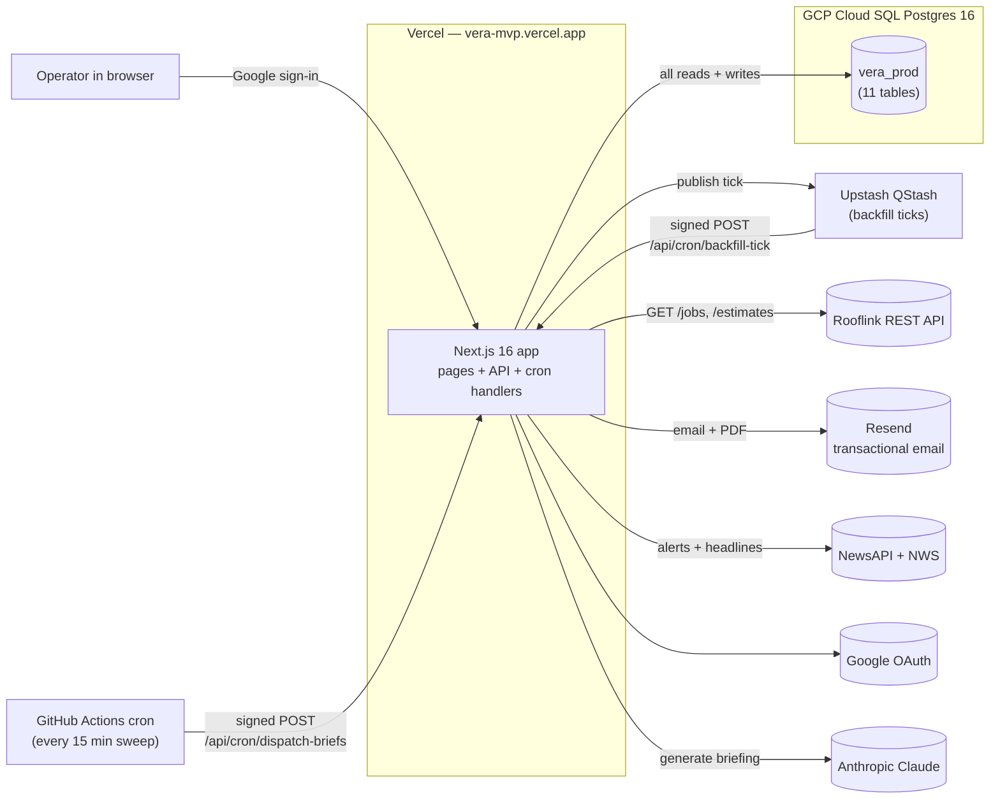

# Infrastructure

The high-level map of what's deployed, where it runs, and how the pieces
talk to each other. If you're new to the project, start here.

> Last updated: 2026-05-14

---

## At a glance



**One tenant today:** Priority Roofs · Dallas (`tenantId = 1`).

---

## Component-by-component

### Web app (`vera-mvp` on Vercel)

- **Framework:** Next.js 16, App Router, deployed as Vercel Functions.
- **Region:** `iad1` (Virginia, US-East). Same continent as the DB.
- **Root directory in the Vercel project:** `apps/web`. The monorepo uses pnpm workspaces; Vercel installs from the workspace root automatically because `packageManager: pnpm@10.x` is declared in the root `package.json`.
- **Auto-deploy:** ⚠️ broken (the Vercel team is owned by `hexabytecode`; the repo by `adityauphade-mac`; they can't see each other's namespace). Push to `main` does not trigger a build. Use `vercel --prod --yes` from the canonical repo until the identity mismatch is resolved.

### Database (`vera_prod` on GCP Cloud SQL)

- **Host:** `34.56.121.151:5432` (shared GCP Cloud SQL instance).
- **Postgres:** 16.13 on Debian.
- **Other databases on the same instance** (out of our scope, must not touch): `bap_dev`, `priority_crm_test_db`, `authentication_service_db`, `quickbooks_data`, `airflow_dev`.
- **Roles:**
  - `vera_app` — scoped owner of `vera_prod` and its `public` schema. **All application traffic uses this role.** Cannot touch any other database on the instance.
  - `postgres` — superuser-ish (CREATEDB + CREATEROLE). For admin/migrations only, from a laptop. Never set on Vercel.
- **Connection:** SSL required (`sslmode=require`). Authorized networks is permissive (`0.0.0.0/0`) — see [`SECURITY.md`](SECURITY.md) for why that's acceptable given the auth layers.
- **Schema:** 11 tables. Full ER diagram in [`DATA_MODEL.md`](DATA_MODEL.md).

### Cron — two engines

| Engine | What it drives | Cadence |
|---|---|---|
| **GitHub Actions** (`.github/workflows/cron-*.yml`) | The 15-min sweeper that polls `BackfillSchedule` and `Schedule` for due rows, plus the daily AI briefing generator | Every 15 min + daily 12:00 UTC |
| **Upstash QStash** | Per-tick delivery for in-flight backfill runs (chains `/api/cron/backfill-tick` calls) | One message per tick, fired by the previous tick |

GitHub Actions was chosen over Vercel Cron because Hobby Vercel caps cron at 2 jobs / 1× daily, which can't run a 15-min sweep.

### External services

| Service | Used for | Auth |
|---|---|---|
| **Rooflink REST API** | Backfill source — `GET /jobs`, `GET /estimates/{id}/line-items` | `RL_KEY` bearer token |
| **Anthropic Claude** (Sonnet 4.6) | AI dashboard briefing + chat ("Ask Vera") | `ANTHROPIC_API_KEY` |
| **Resend** | Outbound brief emails + backfill sync-complete emails (with PDF attachments) | `RESEND_API_KEY`; sender domain `makanalytics.org` |
| **Google OAuth** | Sign-in (Auth.js v5, JWT strategy) | `GOOGLE_CLIENT_ID` / `GOOGLE_CLIENT_SECRET` |
| **NewsAPI + NWS** | Weather alerts + news headlines fed into the briefing prompt | `NEWSAPI_KEY` |

---

## Production env-var checklist

These must be set in **Vercel → Project → Settings → Environment Variables → Production**:

| Variable | Notes |
|---|---|
| `DATABASE_URL` | `postgresql://vera_app:<pwd>@34.56.121.151:5432/vera_prod?sslmode=require` |
| `DATABASE_URL_UNPOOLED` | Same value (Cloud SQL has no pooler). Kept for compat with any code that reads it. |
| `AUTH_SECRET` / `NEXTAUTH_SECRET` | Same value; rotated together. |
| `NEXTAUTH_URL` | `https://vera-mvp.vercel.app` |
| `GOOGLE_CLIENT_ID`, `GOOGLE_CLIENT_SECRET` | Created in GCP project — see [`../GCP_OAUTH_SETUP.md`](../GCP_OAUTH_SETUP.md) |
| `ANTHROPIC_API_KEY` | Claude Sonnet 4.6 |
| `RESEND_API_KEY` | Without it, brief send routes return 503 |
| `RL_KEY` | Rooflink API token |
| `NEWSAPI_KEY` | NewsAPI bearer |
| `CRON_SECRET` | Bearer used by GitHub Actions cron workflows |
| `QSTASH_CURRENT_SIGNING_KEY`, `QSTASH_NEXT_SIGNING_KEY` | Upstash QStash signature verification |

Vestigial Neon-style vars (`POSTGRES_*`, `PGHOST*`, `NEON_PROJECT_ID`, etc.) remain in the Vercel env from the Neon integration era but are unused by application code. Removable opportunistically.

---

## How a request flows in production

```
User clicks /dashboard/aging
   ▼
Vercel Function (Next.js route handler)
   ▼
withAuth(handler)
   ├─ middleware reads __Secure-authjs.session-token (JWT)
   └─ AsyncLocalStorage audit context populated
   ▼
getData(tenantId)
   ├─ cache key probe: SELECT id FROM BackfillRun WHERE promoted=true
   ├─ cache hit (in-memory, per function instance) → return cached
   └─ cache miss:
       ├─ getLiveARJobsWithContext(tenantId)
       │   └─ ONE SQL query against vera_prod:
       │       DISTINCT ON (rooflinkId) latest payload per AR-eligible job,
       │       LEFT JOIN address-count CTE for duplicate-address anomaly
       │   → ~130 rows × ~5 KB ≈ 650 KB transferred
       ├─ Zod parse + toARJob() per row (heat score, aging, anomalies)
       └─ cache result keyed by promoted-run-id list
   ▼
GeneratedData → JSON response to browser
```

Cold start: ~1.5 s end-to-end. Cache hit on the same instance: <50 ms.

---

## Deployment

Single canonical recipe — execute from `/Users/aditya-levich/Build/israil_mvp`,
**never from a worktree** (worktrees bundle their own gitignored data and have
hit Vercel's 100 MB upload limit before).

```bash
# Code-only deploy (after merging to main)
vercel --prod --yes

# Env var change + redeploy (rotating a secret, etc.)
vercel env rm <NAME> production -y
echo "<value>" | vercel env add <NAME> production
vercel --prod --yes
```

### Common build issues

| Symptom | Likely cause | Fix |
|---|---|---|
| Build fails: `Cannot find module @vera/ui` | Vercel project's Root Directory isn't `apps/web` | Settings → General → Root Directory = `apps/web` |
| Build fails: `data/jobs_dedup.jsonl: ENOENT` | The legacy JSONL isn't committed; the build is reaching for it somewhere it shouldn't | Search for any newly-introduced read of `jobs_dedup.jsonl`; the runtime path should not touch it |
| `/api/chat` returns 500 in production | `ANTHROPIC_API_KEY` not set | Add to Production env, redeploy |
| Dashboard returns 500 right after a deploy | `vera_app` role can't reach the DB OR the `LiveJob` materialized view is missing/stale | Smoke-test the merge view query directly against the DB; refresh the view if needed (`REFRESH MATERIALIZED VIEW "LiveJob"`). |
| Deploy times out building → "Out of memory" | Next.js 16 + Tailwind 4 hitting Vercel's default node memory | Set `NODE_OPTIONS=--max-old-space-size=4096` in env |
| Vercel upload exceeds 100 MB | Trying to deploy from a worktree with cached `data/jobs_dedup.jsonl` | Deploy from canonical repo only; `.vercelignore` excludes `worktrees/` (already in place) |

---

## Refreshing the data

**Production data is live.** New backfills push new data automatically. No
deploy required to refresh dashboards.

| What you want | How to do it |
|---|---|
| Pull the latest from Rooflink right now | `/dashboard/scheduler` → Run-now on `rooflink_jobs` and/or `rooflink_lineitems` |
| Schedule recurring backfills | `/dashboard/scheduler` → set cadence (daily / weekly / monthly), pick time |
| Add a one-shot scheduled brief send | `/dashboard/scheduler` → Schedule (uses Resend `scheduled_at`) |

See [`OPERATIONS.md`](OPERATIONS.md) for the full runbook including how to
diagnose a stuck backfill or a failed brief send.

---

## What's deliberately not infrastructure

- No staging environment. Local dev (`vera_dev` on localhost) is the only non-prod target.
- No CDN-level caching of API responses. In-process Vercel function cache only.
- No background workers outside QStash + GitHub Actions. We don't run Sidekiq, Celery, etc.
- No analytics/metrics platform. Vercel built-in metrics only.
