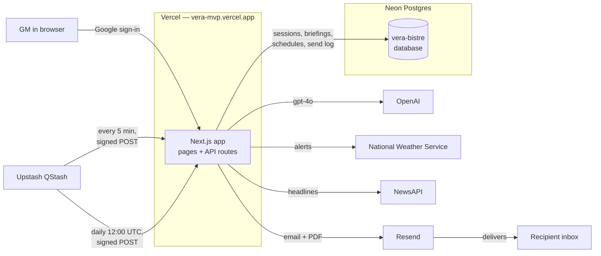
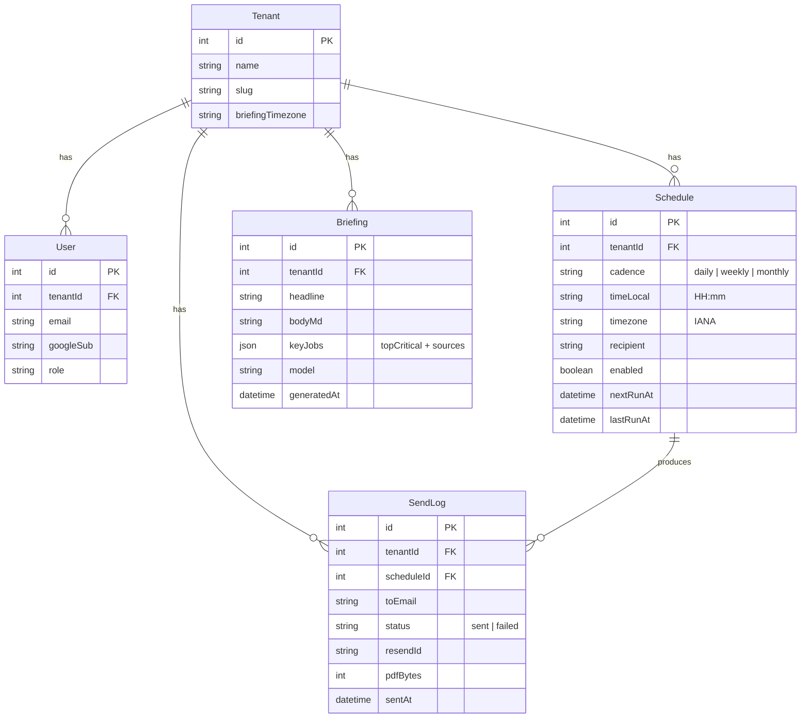
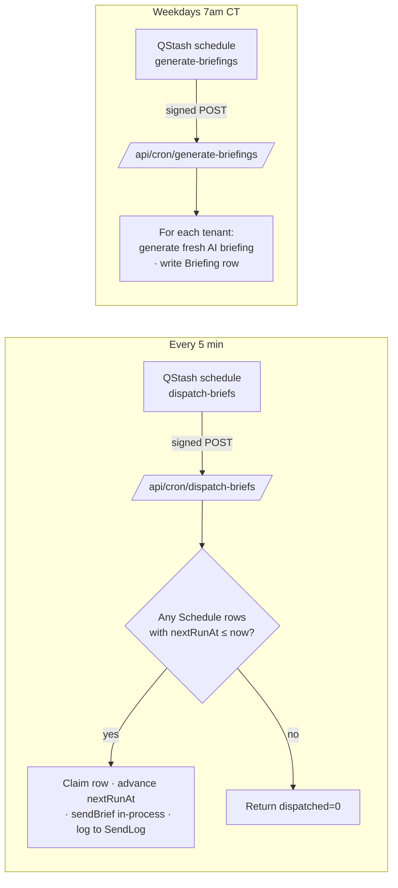
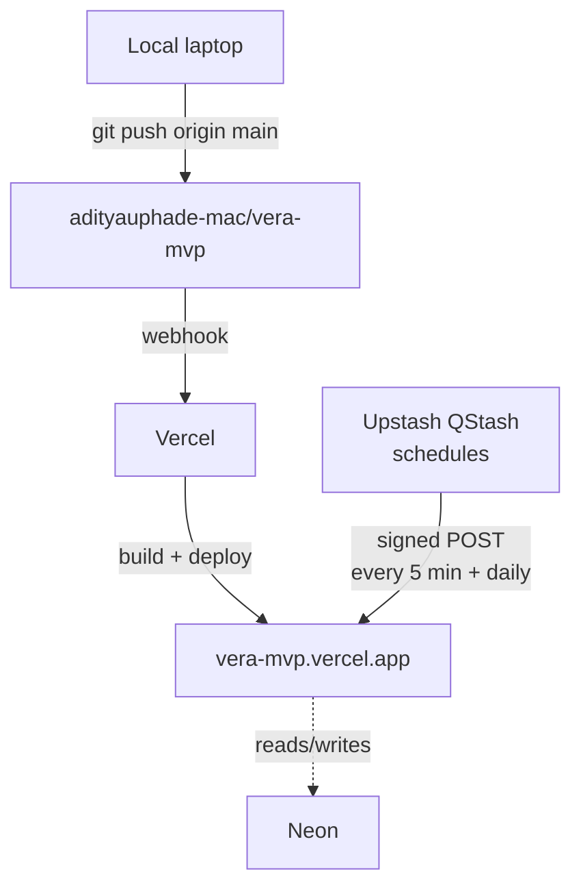

# Vera — Infrastructure

The high-level map of what's deployed, where it runs, and how the pieces talk
to each other. If you're new to the project, start here.

> Last updated: May 11, 2026.

---

## At a glance

Vera is a single Next.js app deployed on Vercel, backed by a Postgres database
on Neon, with two Upstash QStash schedules acting as the cron scheduler. Email
delivery goes through Resend. AI content (the morning briefing) comes from
OpenAI. Sign-in is Google OAuth via Auth.js.

There is one tenant today: **Priority Roofs · Dallas**.

---

## What runs where

| Piece | Where | Why |
|---|---|---|
| Web app | Vercel (vera-mvp.vercel.app) | Next.js 16 App Router, Node runtime |
| Database | Neon (Vercel-managed integration) | Postgres for sessions, briefings, schedules, send log |
| Cron | Upstash QStash | Reliable sub-hour scheduling. Replaced GitHub Actions cron on May 11 — see release note. |
| Email | Resend | Verified sender domain `makanalytics.org` |
| AI | OpenAI gpt-4o (briefing) + gpt-4o-mini (chat) | The model writes the morning briefing and answers chat |
| News context | NWS (free) + NewsAPI | Storm alerts and roofing-industry headlines weave into the briefing |
| Auth | Auth.js v5 + Google OAuth | One Google account → one user in DB → bound to tenant |

---

## Database tables

- **Tenant** — currently one row, Priority Roofs Dallas. Schema is multi-tenant
  ready but only this row exists today.
- **User** — created on first Google sign-in; bound to tenantId=1 by default.
- **Schedule** — when a recurring AR brief should fire. `nextRunAt` is what the
  dispatcher checks.
- **Briefing** — one row per AI-generated dashboard briefing. Most recent row
  is what the dashboard renders.
- **SendLog** — every time the dispatcher attempts a send (success or failure).
  Audit trail.

---

## Routes

### Pages

| Route | Public? | What it is |
|---|---|---|
| `/` | yes | Landing page. CTA reads "Sign in" if anon, "Open the dashboard" if signed in. |
| `/login` | yes | Google sign-in screen. |
| `/docs` | yes | "How I work" handbook. Static content. |
| `/design` | yes | Design system gallery. Internal reference. |
| `/dashboard` | gated | Today's briefing + metric tiles + top three. |
| `/dashboard/aging` | gated | Aging buckets + anomaly side panel. |
| `/dashboard/follow-ups` | gated | Hot jobs + executive review queue. |
| `/dashboard/milestones` | gated | Per-job milestone gaps. |
| `/dashboard/reconciliation` | gated | "Fell through cracks" sweep. |
| `/dashboard/rep-leaderboard` | gated | Per-rep outstanding + metric switcher. |
| `/dashboard/scheduler` | gated | Configure recurring AR brief delivery. |

`gated` = redirected to `/login?callbackUrl=...` if no session.

### APIs

| Route | Auth | Used by |
|---|---|---|
| `/api/auth/[...nextauth]` | n/a | Auth.js handlers |
| `/api/chat` | session | Chat panel, streams Claude responses |
| `/api/jobs/*`, `/api/reps/outstanding` | open | Dashboard pages (data feeds) |
| `/api/briefings/regenerate` | session | "Fetch latest news" button on dashboard |
| `/api/briefings/preview` | open | Local DB-less smoke check |
| `/api/schedules` | session | Scheduler page POST/GET |
| `/api/brief/send` | open | "Send now" button on Scheduler |
| `/api/cron/dispatch-briefs` | bearer | GH Actions every 15 min |
| `/api/cron/generate-briefings` | bearer | GH Actions weekday 7am CT |

> Bearer-gated routes check `Authorization: Bearer <CRON_SECRET>`. Anything
> else returns 401.

---

## Environment variables

Set in **Vercel** (production) and mirrored in `apps/web/.env.local` for
development. Never committed.

| Name | Where used | Notes |
|---|---|---|
| `AUTH_SECRET` / `NEXTAUTH_SECRET` | Auth.js JWT encryption | Must be ≥ 32 random chars |
| `GOOGLE_CLIENT_ID`, `GOOGLE_CLIENT_SECRET` | Google OAuth | From GCP project `vera-ar` |
| `DATABASE_URL` (+ `POSTGRES_*`) | Prisma client | Neon-managed, set automatically by Vercel integration |
| `OPENAI_API_KEY` | Briefing generator + chat | gpt-4o + gpt-4o-mini |
| `NEWSAPI_KEY` | News context for briefing | Free tier OK |
| `CRON_SECRET` | Legacy bearer fallback for cron routes | Still accepted by `verifyCronAuth` for manual `curl` triggering |
| `QSTASH_CURRENT_SIGNING_KEY` | Verifies inbound QStash requests | From Upstash QStash console |
| `QSTASH_NEXT_SIGNING_KEY` | Verifies inbound QStash requests during key rotation | Both keys must be set so QStash can rotate without an outage |
| `RESEND_API_KEY` | Email sending | Israel's Resend account |
| `EMAIL_FROM` | Resend sender | `Vera <vera@makanalytics.org>` (verified domain) |

---

## Cron schedules

Two Upstash QStash schedules, configured in the Upstash dashboard, hit the
Vercel cron routes. Each request is signed by QStash with a JWT in the
`upstash-signature` header; the routes verify it via `lib/cron-auth.ts`
against `QSTASH_CURRENT_SIGNING_KEY` / `QSTASH_NEXT_SIGNING_KEY`.

| Schedule | Cron expression | What it does |
|---|---|---|
| `dispatch-briefs` | `*/5 * * * *` | Polls for due `Schedule` rows and fires the email for each. QStash fires within seconds of the tick, so worst-case lateness is bounded by the 5-min interval. |
| `generate-briefings` | `0 12 * * 1-5` | Regenerates the AI dashboard briefing for each tenant (≈7am Central). |

QStash schedules are managed in the Upstash QStash console (or via the
`/v2/schedules` REST API). See [docs/OPERATIONS.md](OPERATIONS.md) for the
full operator runbook — including how to manually trigger the dispatcher
for testing.

---

## Deployment topology

- Push to `main` → Vercel builds + deploys automatically.
- For an explicit deploy from CLI: `vercel --prod` from the repo root.
- The auth-split fix shipped earlier today keeps the middleware bundle under
  Vercel's 1 MB Edge Function size limit. Don't import `@/lib/auth` from
  middleware — use `@/lib/auth.config` instead.

---

## Domains and URLs

| Purpose | URL |
|---|---|
| Public production | `https://vera-mvp.vercel.app` |
| Per-deploy preview | `https://vera-<hash>-aditya-uphades-projects.vercel.app` |
| Vercel project | `aditya-uphades-projects/vera-mvp` |
| GitHub repo | `https://github.com/adityauphade-mac/vera-mvp` |
| Default branch | `main` |

> Per-deploy preview URLs are protected by Vercel Deployment Protection
> (require a Vercel login). The canonical `vera-mvp.vercel.app` is publicly
> reachable but `/dashboard/*` is gated by our own auth.
