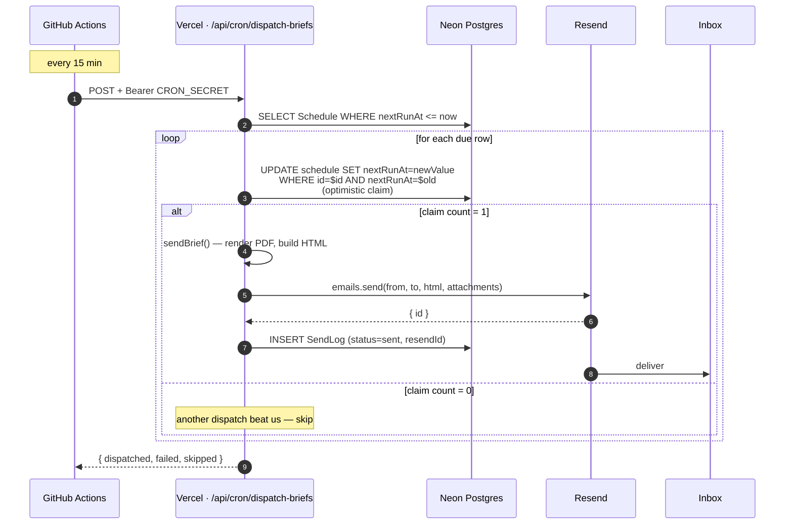
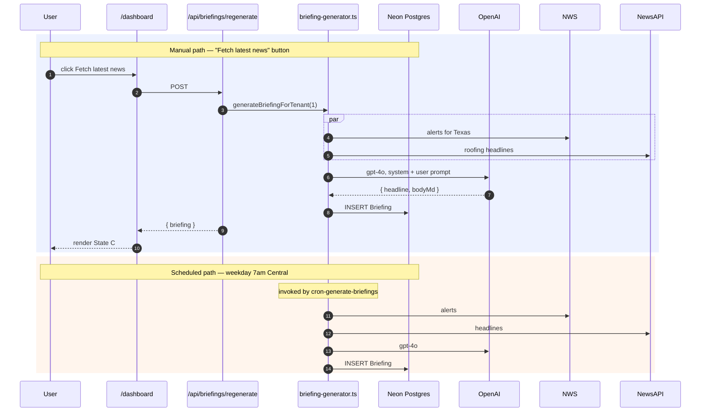
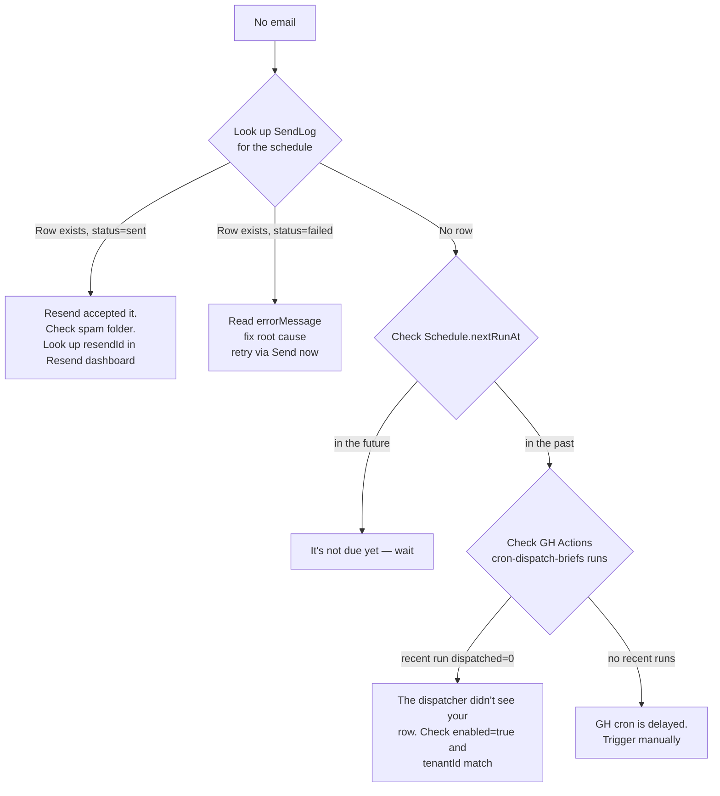

# Vera — Operations runbook

Step-by-step recipes for the things you'll actually do. If `INFRASTRUCTURE.md`
is the map, this is the manual.

> Last updated: May 8, 2026.

---

## Table of contents

1. [How a daily AR brief gets sent](#how-a-daily-ar-brief-gets-sent)
2. [How the dashboard's morning briefing refreshes](#how-the-dashboards-morning-briefing-refreshes)
3. [Schedule a brief for a recipient](#schedule-a-brief-for-a-recipient)
4. [Send a brief right now (one-shot)](#send-a-brief-right-now-one-shot)
5. [Manually trigger the dispatcher](#manually-trigger-the-dispatcher)
6. [Check whether a scheduled brief was sent](#check-whether-a-scheduled-brief-was-sent)
7. [Deploy to production](#deploy-to-production)
8. [Roll back a bad deploy](#roll-back-a-bad-deploy)
9. [Rotate a secret](#rotate-a-secret)
10. [Common troubleshooting](#common-troubleshooting)

---

## How a daily AR brief gets sent

End-to-end: from a row in the `Schedule` table to a PDF in someone's inbox.



Three guarantees:

1. **At most one send per slot.** The optimistic lock on `nextRunAt` means two
   concurrent dispatches can never both fire the same schedule.
2. **Crash-safe.** If we crash after `sendBrief` but before `SendLog`, the
   schedule is already advanced — we won't retry on the next tick.
3. **Drift tolerant.** GitHub cron is rarely on the dot. A schedule for 1:00
   PM might fire at 1:02 PM (typical) or 1:15 PM (worst case during heavy GH
   load). It will not fire at 12:58 PM and it will not fire twice.

What the dispatcher does NOT do:

- It doesn't auto-retry a failed send. If Resend is rate-limited or returns
  500, the failure is recorded in `SendLog` but the schedule still advances.
  Use [Send a brief right now](#send-a-brief-right-now-one-shot) to re-send.

---

## How the dashboard's morning briefing refreshes

Two paths land a fresh AI briefing in the `Briefing` table. The dashboard
always shows the most recent row.



Costs roughly half a cent per briefing (gpt-4o pricing × ~600 tokens). Cached
in DB until the next refresh.

---

## Schedule a brief for a recipient

For the GM (or anyone) to start receiving a daily brief.

1. Sign in at https://vera-mvp.vercel.app/login (Google).
2. Navigate to **Scheduler** in the sidebar.
3. In the **Daily AR brief** row:
   - **Time** — pick on the 15-minute grid (`08:00`, `08:15`, `08:30`, `08:45`,
     etc). Typing a non-grid value snaps to the nearest tick on blur.
   - **Recipient** — any valid email. Resend will deliver to anyone (sender
     domain `makanalytics.org` is verified).
4. Click **Schedule**. You'll see *"Scheduled — next run [date, time, your tz]"*.
5. The brief fires at the specified time, every weekday, until you disable
   the row or delete the schedule.

> The time is interpreted in **your browser's timezone**, not the tenant's.
> Whoever picks the time sees their own local clock. The toast confirms the
> next-run timestamp in the same timezone.

---

## Send a brief right now (one-shot)

Two ways:

### From the UI
On the Scheduler page, click **Send now** in any report row. Hits Resend
immediately, no schedule row created. Use this for ad-hoc sends or to retry
a failed scheduled send.

### Via curl (for ops debugging)
```bash
curl -X POST https://vera-mvp.vercel.app/api/brief/send \
  -H "Content-Type: application/json" \
  -d '{"to":"someone@example.com","cadence":"daily"}'
```

Returns `{ id, scheduledFor, subject, pdfBytes, to }` on success.

---

## Manually trigger the dispatcher

For testing the cron loop without waiting 15 minutes.

```bash
gh workflow run cron-dispatch-briefs.yml \
  --repo adityauphade-mac/vera-mvp

# watch the run
gh run watch
```

The workflow will hit the deployed `/api/cron/dispatch-briefs` with the
`CRON_SECRET` from the repo's GitHub Secrets store. Same path as the
scheduled cron, just on demand.

If you want to fire it without GH involvement (direct curl):

```bash
CRON_SECRET="$(grep '^CRON_SECRET=' apps/web/.env.local | cut -d= -f2- | tr -d '"')"
curl -X POST https://vera-mvp.vercel.app/api/cron/dispatch-briefs \
  -H "Authorization: Bearer $CRON_SECRET"
```

---

## Check whether a scheduled brief was sent

`SendLog` is the audit trail.

```sql
SELECT id, "scheduleId", "toEmail", status, "resendId", "pdfBytes",
       "sentAt" AT TIME ZONE 'Asia/Kolkata' AS "sentIST",
       "errorMessage"
  FROM "SendLog"
 ORDER BY id DESC
 LIMIT 10;
```

| status | meaning |
|---|---|
| `sent` | Resend accepted the email and returned a `resendId`. |
| `failed` | Either `sendBrief` errored or Resend rejected. See `errorMessage`. |

To check Resend's actual delivery state for a `resendId`:

```bash
RESEND_KEY="$(grep '^RESEND_API_KEY=' apps/web/.env.local | cut -d= -f2-)"
curl -s "https://api.resend.com/emails/<resendId>" \
  -H "Authorization: Bearer $RESEND_KEY" | jq '.last_event'
```

`last_event` will be one of: `sent`, `delivered`, `bounced`, `complained`,
`opened`, `clicked`. `delivered` means the recipient's mail server accepted it.

---

## Deploy to production

The fast path is a push to `main`:

```bash
git push origin main      # Vercel auto-builds + deploys
```

Or, from a feature branch, open a PR and merge it. Vercel deploys the merge
commit automatically.

For a same-branch redeploy without going through git (e.g. you changed an env
var):

```bash
vercel --prod --yes
```

After any deploy, smoke-test:

```bash
curl -s -o /dev/null -w "%{http_code}\n" https://vera-mvp.vercel.app/        # 200
curl -s -o /dev/null -w "%{http_code}\n" https://vera-mvp.vercel.app/dashboard  # 307 → /login
```

---

## Roll back a bad deploy

Vercel keeps every deploy. Roll back via CLI:

```bash
# list recent prod deploys
vercel ls --prod

# pick the one BEFORE the bad deploy and promote it
vercel rollback <deployment-url>
```

The rollback completes in seconds. If the bad change was already on `main`,
you also want to revert the commit on git so the next push doesn't re-deploy
the same broken state:

```bash
git revert <bad-sha>
git push origin main
```

---

## Rotate a secret

Any of the encrypted env vars on Vercel.

```bash
# remove the old value
vercel env rm <NAME> production

# add the new value (interactive paste)
vercel env add <NAME> production

# trigger a redeploy so the new value is in use
vercel --prod --yes
```

For `CRON_SECRET` specifically, you also need to update the **GitHub repo
secret** so the workflows keep authenticating:

```bash
gh secret set CRON_SECRET --body "<new-value>"
```

---

## Common troubleshooting

### "I scheduled a brief but it didn't fire"



### "The dashboard briefing is empty / says 'Fetch latest news'"

That's the State A CTA — there's no `Briefing` row yet for this tenant.
Either:
- Click the orange "Fetch latest news" button → generates one immediately, OR
- Wait for the next 7am Central run of `cron-generate-briefings`.

### "Auth says 'Server error / Configuration'"

Auth.js can't decrypt a session. Common causes:
- `AUTH_SECRET` mismatch between local and Vercel
- `AUTH_SECRET` is shorter than 32 chars
- Cookie domain mismatch (rare; only after a domain change)

Fix: regenerate `AUTH_SECRET`, set it on Vercel + locally, redeploy.

### "Push to `.github/workflows/*` fails with 'workflow scope'"

The `gh` CLI token doesn't have `workflow` scope. Refresh:

```bash
gh auth refresh -h github.com -s workflow
```

Then retry the push.

### "Force-push rejected with 'stale info'"

Your local view of the remote ref is out of date. Refresh + retry:

```bash
git fetch origin <branch>
git push --force origin <branch>
```

Use `--force-with-lease` instead of `--force` whenever the remote should not
have moved beyond what you saw.

### "Vercel deploy fails: Edge Function size 1.02 MB > 1 MB limit"

Something pulled Prisma (or another large dep) into the Edge runtime via
middleware. Verify `apps/web/middleware.ts` only imports from
`@/lib/auth.config` (the lightweight config), never from `@/lib/auth` (which
imports the DB). See the `fix(auth)` commit for the canonical split.
