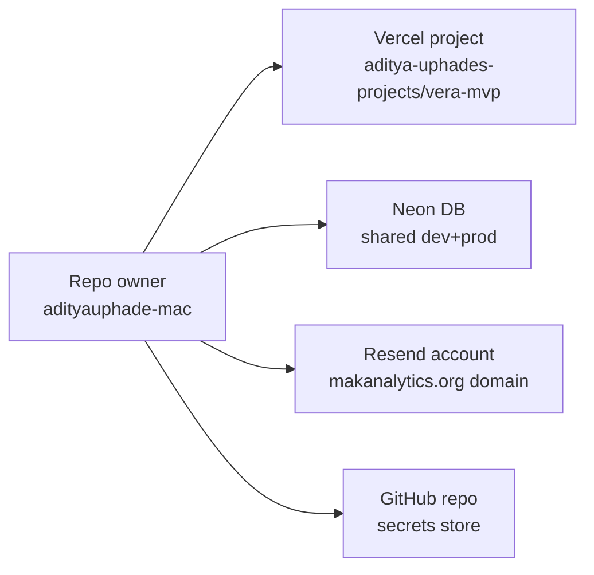

# Vera — Security

Where secrets live, who can access what, and how to rotate.

> Last updated: May 8, 2026.

---

## Who can do what



Today there is **one human with full access**: the GitHub user
`adityauphade-mac`. Every other surface (Vercel, Neon, Resend, GCP)
authenticates back to that identity. Adding a teammate means adding
them at each surface separately.

---

## Where every secret lives

| Secret | Stored in | Used by | Rotation owner |
|---|---|---|---|
| `AUTH_SECRET` / `NEXTAUTH_SECRET` | Vercel env (production) + `apps/web/.env.local` | Auth.js JWT encryption | repo owner |
| `GOOGLE_CLIENT_ID` + `GOOGLE_CLIENT_SECRET` | GCP project `vera-ar` → Credentials | Google OAuth handshake | repo owner |
| `DATABASE_URL` (+ `POSTGRES_*`) | Vercel-managed Neon integration → auto-injected env | Prisma client | Vercel/Neon (auto) |
| `OPENAI_API_KEY` | Vercel env + `.env.local` | Briefing generator + chat | repo owner |
| `NEWSAPI_KEY` | Vercel env + `.env.local` | News context for briefing | repo owner |
| `CRON_SECRET` | Vercel env + GitHub repo secret + `.env.local` | Bearer auth for `/api/cron/*` | repo owner |
| `RESEND_API_KEY` | Vercel env + `.env.local` | Email sending | repo owner |
| `EMAIL_FROM` | Vercel env + `.env.local` | Verified Resend sender | repo owner |

**Three storage locations** for each secret in the worst case:
1. Vercel project env (the runtime source of truth)
2. The local `.env.local` (gitignored — for development)
3. For `CRON_SECRET` only: also a GitHub repo secret (so workflows can authenticate)

Keep the values in sync. Drift = production breaks silently.

---

## How to rotate a secret

```bash
# 1. Generate a new value (example: AUTH_SECRET)
openssl rand -hex 32

# 2. Replace on Vercel
vercel env rm AUTH_SECRET production
vercel env add AUTH_SECRET production
# (paste the new value when prompted)

# 3. Replace in your local .env.local
$EDITOR apps/web/.env.local

# 4. For CRON_SECRET only: also update the GitHub repo secret
gh secret set CRON_SECRET --body "<new value>"

# 5. Redeploy so the new value is live
vercel --prod --yes
```

After rotation:
- Active sessions invalidate on `AUTH_SECRET` rotation (users have to sign in again — JWT cookies signed with the old secret won't decrypt)
- Active scheduled cron triggers continue working only after both Vercel and GitHub have the new `CRON_SECRET`

---

## What's in the codebase vs out

| | In repo | In env |
|---|---|---|
| Connection strings | ❌ | ✓ (`DATABASE_URL`) |
| API keys | ❌ | ✓ (every `*_API_KEY`) |
| OAuth client IDs | ❌ | ✓ (`GOOGLE_CLIENT_ID`) |
| OAuth client secrets | ❌ | ✓ (`GOOGLE_CLIENT_SECRET`) |
| JWT signing keys | ❌ | ✓ (`AUTH_SECRET`) |
| Tenant data | ❌ (gitignored at `data/`) | n/a — in DB |
| `.env.local` | ❌ (gitignored) | n/a |

`.gitignore` lines that protect us:

```
.env
.env.local
.env.*.local
data/jobs_dedup.jsonl
data/generated.json
.vercel
```

Anything that requires a secret to function lives in `apps/web/.env.local`
(local) or Vercel project env (deployed).

---

## OAuth scope policy

Auth.js v5 with Google provider. We request **only**:

- `openid`
- `email`
- `profile`

That's it. No Drive, no Calendar, no offline access. The `signIn`
callback in `lib/auth.ts` runs once per user creating the row in our DB
and binding to a tenant. After that the JWT lives in a cookie; we never
hit Google again until the next sign-in.

**Whitelist policy: open.** Any signed-in Google account is admitted on
first sign-in (per `IMPROVEMENTS.md` §2.4 — fine for v1; tighten to a
domain rule when going wider).

To restrict to a specific email domain (e.g. `@priorityroofs.com`),
modify `lib/auth.ts`'s `signIn` callback:

```ts
async signIn({ user }) {
  if (!user.email?.endsWith('@priorityroofs.com')) return false;
  // ...rest of the signIn logic
}
```

---

## What's PII / sensitive in the DB

| Table | Sensitive columns | Notes |
|---|---|---|
| `User` | `email`, `googleSub`, `imageUrl`, `name` | Standard Google profile fields |
| `Briefing` | `bodyMd`, `keyJobs.topCritical[].customerName`, `keyJobs.topCritical[].rep` | Contains customer + rep names + dollar amounts. Treat as confidential. |
| `Schedule` | `recipient` | Email addresses |
| `SendLog` | `toEmail`, `errorMessage`, `resendId` | Email addresses + Resend trace IDs |

Read-only access to the Neon DB (via Vercel) leaks all of the above.
Don't share `DATABASE_URL` casually. If a teammate needs DB access:
- Create a read-only Postgres role in Neon
- Generate a separate connection string for them
- Don't reuse the prod-app `DATABASE_URL`

---

## What an attacker could try (and why it doesn't work)

| Attack | Why it fails today |
|---|---|
| Hit `/api/cron/dispatch-briefs` to fire schedules | Bearer-gated by `CRON_SECRET`; without it → 401 |
| Hit `/api/schedules` to read another tenant's schedules | `auth()` middleware: returns 401 unauth, then queries scoped to `session.user.tenantId` |
| Forge an Auth.js cookie | JWT signed with `AUTH_SECRET` (32 hex chars). Without the secret, can't sign valid tokens |
| Sign in with someone else's Google account | OAuth callback verifies Google's ID token signature; can't be spoofed |
| Read source for keys | All keys gitignored. Code only references `process.env.*` |
| Read prod env via leaked deployment URL | Per-deploy hashed URLs are protected by Vercel Deployment Protection (require Vercel SSO). Canonical `vera-mvp.vercel.app` is public but doesn't expose env |

What still **could** go wrong:
- Compromise of the `adityauphade-mac` GitHub account → full access to everything
- Compromise of the Vercel team account → can read prod env vars
- Resend domain compromise → attacker could send mail as `vera@makanalytics.org`

Mitigations: 2FA on GitHub + Vercel + Resend + GCP; periodic key rotation;
audit `gh secret list`, `vercel env ls`, and Resend's API-key page
quarterly.

---

## Reporting a security issue

Don't open a public GitHub issue for security findings. Email the repo
owner directly (`adityauphade@makanalytics.org`) with details and a
proposed fix if you have one.
