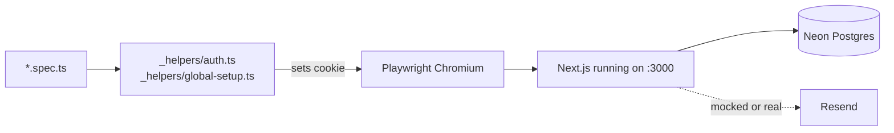

# Vera — Testing

What's tested, how to run it, and how to add new tests.

> Last updated: May 8, 2026.

---

## What we have

**One test framework: Playwright** — end-to-end only, no unit tests in the
MVP. The reasoning is in `CLAUDE.md`: pure domain functions are simple
enough that E2E catches the meaningful regressions.

| Counter | Number |
|---|---|
| Specs in default suite | **96 passing** as of May 8 |
| Specs gated behind opt-in env vars | 1 (`cron-dispatch-race`, `RUN_RACE_TEST=1`) |
| Specs in `testIgnore` (audit + ad-hoc) | ~5 |



---

## Running the suite

```bash
# the default suite (excludes audit / prod / opt-in specs)
PLAYWRIGHT_BASE_URL=http://localhost:3000 pnpm exec playwright test

# a single spec
pnpm exec playwright test landing

# UI mode (interactive — see what each test does)
pnpm exec playwright test --ui

# headed mode (see the browser; useful for debugging)
pnpm exec playwright test --headed
```

> **Local server first.** Specs assume a dev or prod-mode server is
> running on `:3000`. Either run `pnpm --filter @vera/web dev` in a
> second terminal first, OR omit `PLAYWRIGHT_BASE_URL` so Playwright
> starts its own server (slower — has to build).

---

## How auth-gated specs work

The dashboard is auth-gated. Real Google OAuth can't run headlessly, so
we **mint an Auth.js JWT cookie offline** using the same `AUTH_SECRET`
the running app uses. No production backdoor; no test-only routes.

```ts
// in any spec
import { signInAs } from './_helpers/auth';

test.beforeEach(async ({ context }) => {
  await signInAs(context);
});

test('dashboard renders', async ({ page }) => {
  await page.goto('/dashboard');           // ← passes the auth gate
  // ...assertions
});
```

The helper writes a real JWT into the `authjs.session-token` cookie. The
middleware decrypts it with `AUTH_SECRET` and sees a populated session
exactly as if the user signed in via Google.

`signInAs` accepts overrides if a spec needs a specific identity:

```ts
await signInAs(context, {
  email: 'someone@example.com',
  tenantId: 1,
  role: 'admin',
});
```

---

## How the DB stays deterministic

`tests/e2e/_helpers/global-setup.ts` runs once per suite invocation and
**wipes the `Briefing` table**. Specs that need a Briefing seed it
themselves (or mock the regenerate API and `click Fetch latest news`).

If you add a spec that depends on other DB state, either:
- mock the API at the route level via `page.route('**/api/...', …)`, or
- seed inside `test.beforeEach` and clean up in `test.afterEach`

---

## Spec organization

```
tests/e2e/
├── _helpers/
│   ├── auth.ts                  ← signInAs JWT helper
│   └── global-setup.ts          ← DB reset before suite
├── _audit-*.spec.ts             ← ad-hoc audit screenshots (testIgnored)
├── _debug-*.spec.ts             ← debug spelunking (testIgnored)
├── prod-*.spec.ts               ← run against deployed prod URL (testIgnored)
├── chat-live.spec.ts            ← real Claude API call (RUN_LIVE_AI=1)
├── cron-dispatch-race.spec.ts   ← parallel-dispatch race (RUN_RACE_TEST=1)
└── *.spec.ts                    ← regular regression specs in the default suite
```

Naming convention: anything you don't want running in the default suite
gets prefixed `_` or `prod-`. The `playwright.config.ts` `testIgnore`
list filters them out.

---

## Coverage map

| Area | Spec | What it asserts |
|---|---|---|
| Landing | `landing.spec.ts` | Hero copy, conditional CTA (anon "Sign in" vs signed-in "Open the dashboard"), bounce-to-login flow |
| Auth gate | every dashboard spec | `/dashboard/*` redirects to `/login?callbackUrl=…` without a session |
| Dashboard overview | `dashboard-overview.spec.ts` | Briefing card, metric tiles, top-three section |
| Briefing card | `briefing-card.spec.ts` + `briefing-chip-overflow.spec.ts` | State A → State C, bolded headline, source chips, mobile chip overflow |
| Aging | `aging.spec.ts` + `tooltip.spec.ts` | Bucket tiles, anomaly side panel, JobDetailSheet open/close, default past-terms-only filter, view-all reset |
| Follow-ups | `follow-ups.spec.ts` | Hot vs Exec tabs, draft-email modal |
| Milestones | `milestones.spec.ts` | Per-job missing-tag rendering, JobDetailSheet on row click |
| Reconciliation | `reconciliation.spec.ts` | Header narrative + metric tiles |
| Rep leaderboard | `rep-leaderboard.spec.ts` | Metric chip switcher, period selector, MTD/YTD primary |
| Scheduler | `scheduler.spec.ts` | Header, three rows, Send-now disabled until valid recipient, Schedule button presence |
| Schedules API | `schedules-api.spec.ts` | 401 unauth, signed-in POST + GET round-trip, validation 400 |
| Chat panel | `chat.spec.ts` | Open, suggestions, input enables on type, close |
| Mobile | `mobile-overflow.spec.ts` + `mobile-regression.spec.ts` | No horizontal page overflow at 375px, full-page screenshots of each route |
| Exit animations | `exit-animations.spec.ts` | ChatPanel, MobileNav, JobDetailSheet all play `vera-{modal,drawer,sheet}-out` mid-close |
| Docs / Design | `docs.spec.ts` + `design-system.spec.ts` | Sections render, scrollspy, design system gallery |
| API endpoints | `api.spec.ts` | `/api/jobs/*` and `/api/reps/outstanding` return valid AR data |
| Visual audit | `zz-visual-audit.spec.ts` | Body bg/color tokens applied on every route, no console errors |

---

## Race regression for the dispatcher

`tests/e2e/cron-dispatch-race.spec.ts` is the proof of at-most-once
delivery. It fires **10 parallel POSTs** to `/api/cron/dispatch-briefs`
against a forced-due schedule and asserts:

- exactly **1** outcome was `sent` (not 10)
- exactly **1** SendLog row written
- `nextRunAt` advanced exactly once

It needs `CRON_SECRET` in env and writes one real Resend send (recipient
`race-test@example.com`), so it's gated behind `RUN_RACE_TEST=1`:

```bash
RUN_RACE_TEST=1 pnpm exec playwright test cron-dispatch-race
```

If you ever suspect the optimistic lock in `dispatch-briefs/route.ts` is
broken, this is the test to run.

---

## Adding a new spec

1. Create `tests/e2e/<feature>.spec.ts`.
2. If the feature is auth-gated, `import { signInAs } from './_helpers/auth'` and call it in `beforeEach`.
3. If the feature does external HTTP (LLM, Resend, etc.), either:
   - mock at the route level: `page.route('**/api/foo', (r) => r.fulfill({ ... }))`
   - or gate the spec behind `RUN_FOO=1` in env and `test.skip()` when missing
4. Run locally: `pnpm exec playwright test <feature>`
5. PR. Suite must be green to merge.

---

## CI

Currently we run the suite manually before pushing. There is no GitHub
Actions CI workflow that runs the full Playwright suite. If you want
that, here's the spike: a workflow on `pull_request` that runs
`pnpm install && pnpm --filter @vera/web build && pnpm exec playwright test`.
About 70-90 seconds total — fine for a PR gate.
